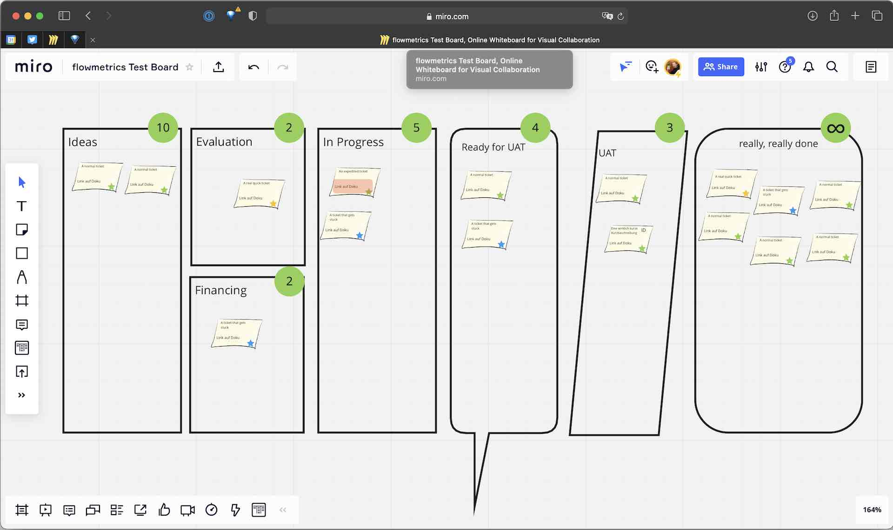
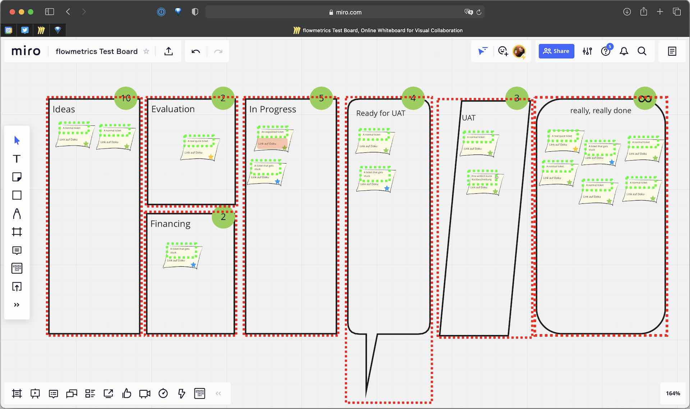
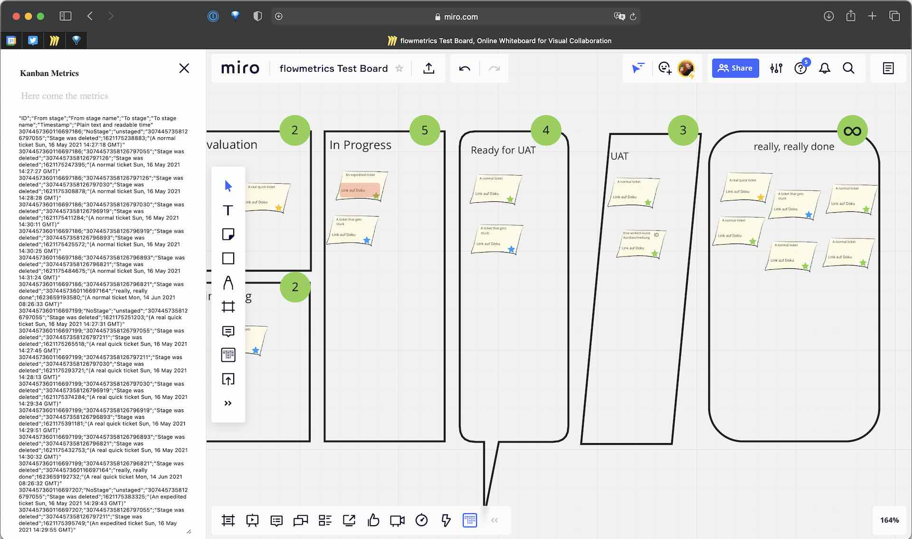
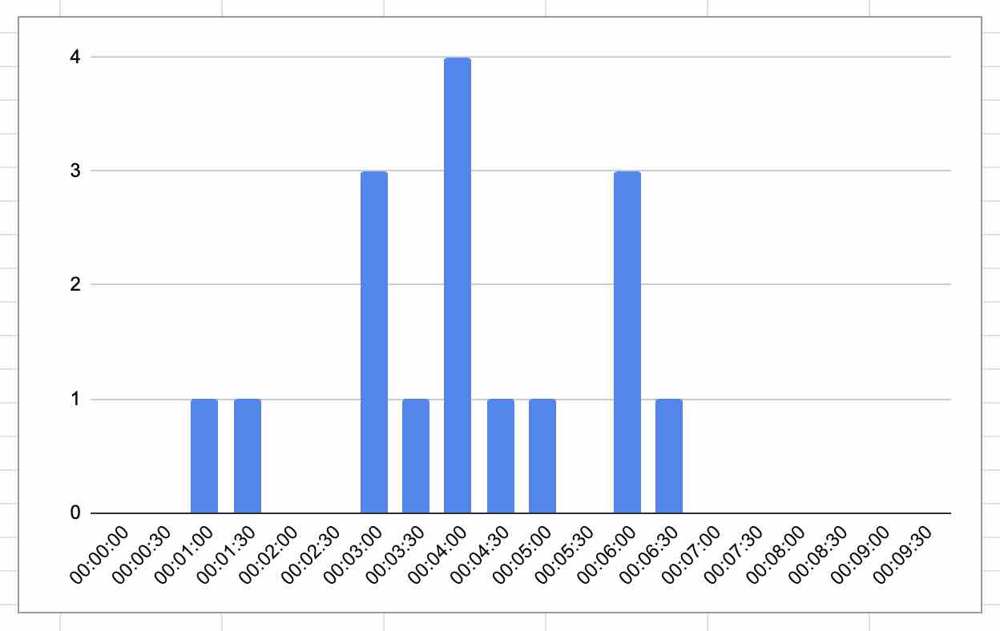
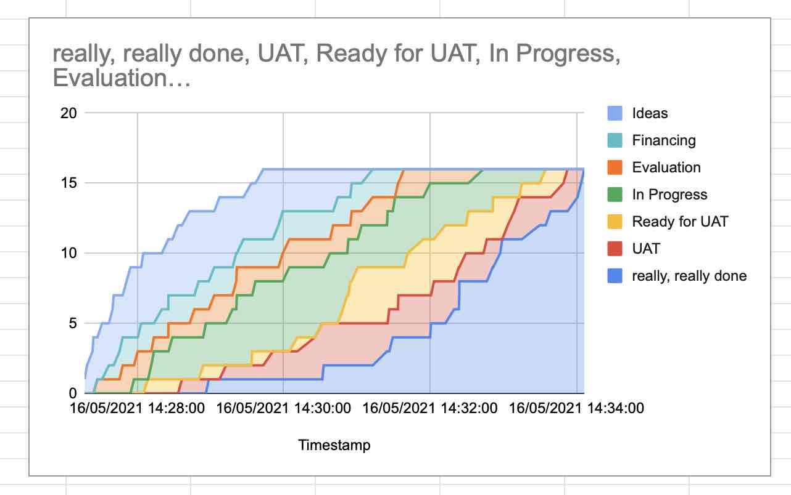

# A plugin to collect (Kanban) flow metrics for miro boards

This plugin helps teams who want to structure their work using a free form 
board in [Miro](https://miro.com/) by also enabling easy collection of 
statistical data. 

## This is mostly a _proof of concept_

As of June 2021 this is just a side project with the intention of showing that
it is _**possible**_ to get the statistical data necessary for fact based,
probabilistic management of workitems.

Please feel free to either contribute to this project via forking and pull requests or by building your own solutions based on the ideas demonstrated here.

## _**Caveat: Currently the persistence mechanism of Miro is broken**_

We're experimenting with several other ways to store the data, but until the
[persistence bug filed with
Miro](https://community.miro.com/developer-platform-and-apis-57/metadata-updated-are-not-persistent-4761)
is solved, users can not rely on the tool.

## Okay, but what does it do
We start from a free-form visualization of the work and the way the work flows:

After instrumenting the graphical elements and marking them either as Kanban Work Items (green border) or Kanban Stages (red border) the plugin is able to register the movement of items between stages

Finally this enables us to collect statitical data which can be exposed in csv-format. (Although it maybe should be calles ssv since we use semicolons for maximum excel compatibility)

## What do I do with the raw data?
Using the csv-data it is extemely easy to generate at least two of the most important evaluations for flow management namely the Lead Time Distribution (LTD) and the Cummulative Flow Diagram (CFD).

###  You need about four formulas to generate an LTD like this

(There is also a [video explaining how to get the LTD](https://youtu.be/yzTEHlVWCoQ) )

### With just two formulas you get a CFD as well

(There is also a [video explaining how to get the CFD](https://youtu.be/TmJg6CwUu64) )

## How can I try it?

### Watch the video
You can [watch a video of the plugin in use](https://youtu.be/2xiKMR-zCX4). (Up until now only in German)

### Try it by installing the development version
The development(!) version (up until now there is **_no production version_**) of the plugin can be installed for a miro team by visiting [the plugins verification page](https://miro.com/oauth/authorize/?response_type=code&client_id=3074457348136685529&redirect_uri=https%3A%2F%2Fmiroplugins.devisive.de%2Fflowmetrics%2Finstall.php) This development version of the plugin can change any time or might even be broken from time to time. 

### Try it by installing your own version of it
As explained on Miro's website you can also create a _dev team_ for your account in Miro and start developing your own Miro plugins. A good starting point for this is https://developers.miro.com/docs/getting-started

(If you want to go down that road (some call it rabbit hole), it might be helpful that some internal notes about things that we tend to forget can be found in [docs/dev_cheatsheet.txt](docs/dev_cheatsheet.txt))

If you want to get involved in any way (as a user, as a devloper or as anything we didn't think about) please feel free to open up a [gihub issue](https://github.com/MichaelMahlberg/mirometrics/issues/new) even if you just want to chat.